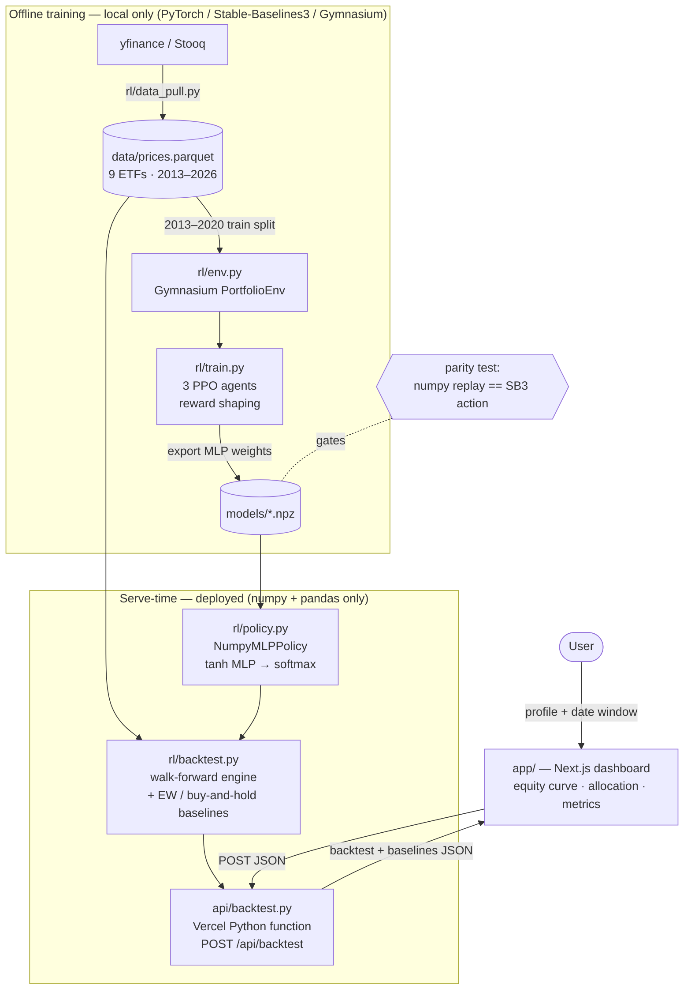

# RL Portfolio Optimizer

Interactive reinforcement-learning portfolio allocator — three reward-shaped PPO agents, trained offline on real ETF data, served on Vercel's free tier with zero PyTorch in production.

[**▶ Live demo**](https://rl-portfolio-optimization-shiv-a.vercel.app) &nbsp;·&nbsp;    

## Recruiter TL;DR

- **What it does:** Lets you pick a risk profile (Conservative / Balanced / Aggressive) and run a live out-of-sample backtest of a PPO reinforcement-learning agent allocating across nine ETFs, charted against equal-weight and buy-and-hold baselines.
- **Hardest problem solved:** Shipping a PyTorch-trained RL policy on a serverless free tier by exporting the trained network to plain numpy — training uses PyTorch/Stable-Baselines3, but the deployed function imports **only numpy + pandas**, guarded by a parity test that proves the numpy replay matches Stable-Baselines3 exactly.
- **Honest result:** The agents underperform passive baselines on raw return out-of-sample (a well-documented RL-for-trading finding), but reward shaping produces a coherent risk spectrum in which the **Conservative agent has the lowest max drawdown (−20%) of any strategy tested** — including both baselines.

> **Not investment advice.** This is a research/engineering demonstration of applying RL to portfolio allocation, evaluated honestly out of sample. Nothing here is a recommendation to buy, sell, or hold any security.

## Overview

General-purpose portfolio allocation under uncertainty is a classic reinforcement-learning control problem, and one that quant funds (Two Sigma, Citadel, and peers) invest heavily in. This project builds the full loop end-to-end as a portfolio piece: a custom trading environment, reward-shaped agents that express distinct risk appetites, an honest out-of-sample backtest with real financial metrics, and a deployed interactive demo — with the engineering discipline (train/serve separation, parity testing, no data leakage) that separates a real ML system from a notebook.

The distinguishing constraint was **shipping it on a free tier**. That drove the central design decision: the model trains with heavyweight deps but serves as a pure-numpy forward pass, so the deployed backend stays tiny.

## Architecture



**The numpy-serving trick.** Training needs torch, Gymnasium, and Stable-Baselines3 — none of which belong in a serverless function. `rl/train.py` extracts the trained policy's linear layers (`policy_net` + `action_net`) into plain numpy arrays saved as `models/{profile}.npz`; `rl/policy.py` replays the forward pass (`tanh` MLP → softmax) with nothing but numpy. `rl/tests/test_export_parity.py` asserts the numpy replay matches Stable-Baselines3's own deterministic action before it's ever trusted. `requirements.txt` (serve-time) lists only `numpy`, `pandas`, `pyarrow`; `requirements-train.txt` layers `torch`/`stable-baselines3`/`gymnasium`/`yfinance` on top for local training only, and `.vercelignore` keeps it out of the deploy bundle.

**No look-ahead leakage.** The asset universe and split live once in `data/UNIVERSE.py` and are imported everywhere (training, backtest, API): training uses `2013-01-01 → 2020-12-31`; all reported results are out-of-sample, `2021-01-01` onward. The agents never see post-2020 prices during training, and the backtest engine only ever looks backward (a `lookback`-day trailing window) when it rebalances. The frontend joins the agent and baseline equity curves by index, which is only safe because the API aligns all three series to an identical date axis (`api/backtest.py`).

## Reward shaping

All three agents share the same environment, observation space, and network (`[64, 64]` tanh MLP). They differ **only** in two reward coefficients:

```
reward = log_return − lambda_risk · ex_ante_vol − lambda_cost · cost · turnover
```

where `ex_ante_vol = sqrt(wᵀ Σ w)` (trailing-window Markowitz portfolio volatility) and `turnover = Σ|new_weights − old_weights|`.

| Profile | `lambda_risk` | `lambda_cost` |
|---|---|---|
| Conservative | 100.0 | 0.5 |
| Balanced | 12.0 | 0.3 |
| Aggressive | 0.0 | 0.1 |

Higher `lambda_risk` penalizes ex-ante volatility more, pushing toward bonds/gold/diversification; higher `lambda_cost` penalizes turnover more, pushing toward less frequent rebalancing. (`rl/train.py`, `PROFILE_PARAMS`.)

> **Design note:** an earlier reward used *realized* rolling variance, which barely moved allocations (the agent couldn't attribute it to its own actions) and collapsed "conservative" into one concentrated asset. Switching to the *ex-ante* Markowitz term above — a quantity the agent controls directly through its weights — is what produced the clean risk gradient below.

## Out-of-sample results (2021-01-01 → 2026-07-10, monthly rebalance)

Measured directly from `/api/backtest` against `data/prices.parquet` — nothing simulated or hand-tuned after the fact.

| Strategy | Defensive alloc | Equity alloc | Total return | Sharpe | Max drawdown |
|---|---|---|---|---|---|
| Conservative agent | 80% | 10% | +10% | 0.27 | **−20%** |
| Balanced agent | 64% | 19% | +29% | 0.55 | −21% |
| Aggressive agent | 35% | 35% | +35% | 0.49 | −28% |
| Equal-weight (monthly) | — | — | +57% | 0.70 | −26% |
| SPY buy & hold | — | — | +117% | 0.91 | −24% |

"Defensive" = AGG + TLT + GLD average allocation; "Equity" = SPY + QQQ + IWM average allocation. (The remaining three tickers — EFA, EEM, VNQ — fall in neither illustrative bucket.)

### Honest findings

All three RL agents **underperform both passive baselines** on raw total return and Sharpe out of sample. This is a common, well-documented result in RL-for-portfolio-allocation: a multi-year, mostly-up equity bull market is close to the hardest regime for a risk-averse agent to beat on raw return, and this project reports that rather than hiding it.

What the reward shaping *does* achieve, cleanly:

- **A coherent, monotonic risk spectrum.** Defensive allocation decreases strictly Conservative (80%) → Balanced (64%) → Aggressive (35%), matching the ordering of `lambda_risk`. The three agents are not copies — reward shaping visibly and consistently changes behavior.
- **Real capital protection.** The Conservative agent has the **lowest max drawdown of any strategy in the table (−20%)** — lower than Balanced, Aggressive, equal-weight, and SPY. It gives up return to buy that protection: exactly the trade a risk-averse allocator should make.

The interesting result isn't "RL beats the market" (it doesn't, here) — it's that a single environment with two reward coefficients reliably produces a real, ordered risk/return spectrum, with the most risk-averse setting delivering the best tail protection in the comparison.

## Skills Demonstrated

- **Reinforcement learning** — custom Gymnasium environment, PPO (Stable-Baselines3), reward shaping to induce distinct policies from one architecture
- **Production ML deployment / MLOps** — clean train/serve separation; model-weight export; a parity test gating the offline→online handoff
- **System design & architecture** — resolving a real constraint (serverless size limits) with a deliberate tradeoff (numpy-only inference) rather than heavier infra
- **Quantitative / financial modeling** — walk-forward backtesting, Sharpe, max drawdown, CAGR, transaction-cost modeling, strict chronological splits to prevent look-ahead leakage
- **Full-stack engineering** — Next.js (App Router) frontend + Python serverless API, integrated and deployed
- **RESTful API design** — validated `POST /api/backtest` with structured error responses
- **Test-driven development** — 30 tests (env, backtest, metrics, numpy/SB3 parity, API contract) written test-first
- **Cloud deployment** — live on Vercel (Python function + Next.js), free-tier-constrained
- **Data engineering** — reproducible price-history pipeline from a live source to a committed, column-ordered, gap-filled parquet snapshot

## Tech stack

- **Training (offline, local only):** PyTorch, Stable-Baselines3 (PPO), Gymnasium, pandas, numpy, yfinance / pandas-datareader
- **Serving (deployed):** pure numpy + pandas — no torch, no SB3, no gymnasium
- **API:** Vercel Python serverless function (`api/backtest.py`; Python auto-detected, pinned to 3.12 via `.python-version`)
- **Frontend:** Next.js (App Router), React, Recharts
- **Testing:** pytest (Python), Vitest + Testing Library (frontend)

## Getting started

```bash
# 1. Training deps (torch, SB3, gymnasium, data pull) — only needed to retrain
pip install -r requirements-train.txt

# 2. Pull real ETF price history -> data/prices.parquet
python -m rl.data_pull

# 3. Train the 3 PPO agents and export models/*.npz
python -m rl.train

# 4. Frontend dev server (uses the committed models/*.npz + data)
npm install && npm run dev
```

The frontend and serve-time API run from the committed `models/*.npz` and `data/prices.parquet` without retraining — steps 1–3 are only for training from scratch. Note that `next dev` alone does **not** run the Python function; use `vercel dev` (or the live deployment) to exercise `/api/backtest` end-to-end locally.

## Usage

```bash
curl -s -X POST https://rl-portfolio-optimization-shiv-a.vercel.app/api/backtest \
  -H "Content-Type: application/json" \
  -d '{"profile":"conservative","start":"2021-01-01","end":"2025-01-01","rebalance":"M"}'
```

Returns `{ "agent": {...}, "baselines": { "equal_weight": {...}, "spy": {...} } }`, where each series carries `dates`, `equity` (normalized to 1.0 at the window start), `weights_timeline`, and `metrics` (total return, CAGR, annualized vol, Sharpe, max drawdown, average turnover). `profile` ∈ `{conservative, balanced, aggressive}`; `rebalance` ∈ `{D, W, M}`; invalid input returns `400` with a structured `{"error": ...}`.

## Project structure

```
rl/
  data_pull.py   # pull daily ETF prices -> data/prices.parquet (offline)
  env.py         # Gymnasium PortfolioEnv (training-only; imports gymnasium)
  train.py       # train 3 PPO agents + export policy weights to models/*.npz
  policy.py      # NumpyMLPPolicy — pure-numpy inference (no torch)
  backtest.py    # walk-forward backtest engine + baselines (numpy + pandas)
  metrics.py     # total return, CAGR, annualized vol, Sharpe, max drawdown
  tests/         # env, backtest, metrics, policy, export-parity, API tests
data/UNIVERSE.py # single source of truth: tickers + chronological split
api/backtest.py  # Vercel Python function, POST /api/backtest (serve-time)
app/             # Next.js App Router dashboard
models/*.npz     # committed, exported policy weights (numpy)
```

## Testing

```bash
pytest        # 29 Python tests: env, backtest, metrics, policy, export-parity, API
npm test      # frontend component smoke test (Vitest + Testing Library)
```

The parity test (`rl/tests/test_export_parity.py`) is the load-bearing one: it asserts the numpy serve-time policy reproduces Stable-Baselines3's deterministic action within `1e-5`, so the offline→online weight export can't silently drift.

## Deployment

**Live:** https://rl-portfolio-optimization-shiv-a.vercel.app — deployed on Vercel (Hobby/free tier), publicly accessible.

The Next.js frontend and the Python `/api/backtest` function deploy together from the repo root. Vercel auto-detects the Next.js app; `vercel.json` configures the Python function to bundle `rl/`, `data/`, and `models/` via `includeFiles`, and `.vercelignore` excludes training-only code (`requirements-train.txt`, `rl/tests/`, `docs/`) so the serverless bundle stays numpy/pandas-only.

```bash
npx vercel          # preview deploy
npx vercel --prod   # promote to production
```

## Roadmap / future work

- **Genuinely competitive RL** — more training timesteps, richer features (momentum, volatility-regime signals), and reward/hyperparameter tuning to actually challenge the passive baselines. RL-for-trading is hard and this is an honest stretch goal, not a promise.
- **Experiment tracking** — MLflow over the three training runs.
- **Screenshot / GIF** of the live dashboard in this README.
- **Minor cleanups** — categorize the remaining three tickers in the results footnote; narrow the broad `except` in `rl/data_pull.py`.

## License

No license file yet. Add one (MIT is a common choice for a portfolio project) before inviting reuse.
